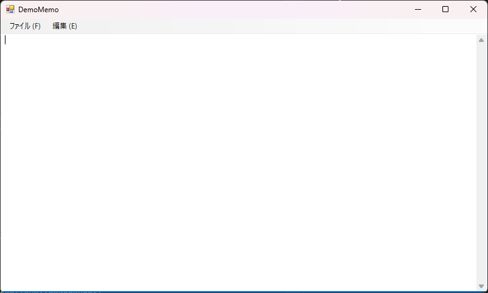
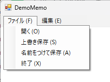
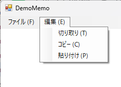

## 概要

Windows Forms アプリケーション (.NET Framework) で作成すること。

言語は Visual Basic .NET

実装の目安：1日

## 機能

### メイン画面

- [ ] メイン画面は以下の構成とすること

要素 | クラス | Name
-- | -- | --
メニュー | `MenuStrip` | `mnuMain`
テキストボックス | `TextBox` | `txtEditor`

- [ ] ウィンドウタイトルは `DemoMemo` とすること
- [ ] メニューはフォーム上部に固定されていること
- [ ] テキストボックスはメニューを除く部分全体に拡がり、画面サイズの変更に追従すること
- [ ] メインメニューは [ファイル (F)][編集 (E)] の構成とすること
- [ ] メニューの (F), (E) などは Alt キーとの組み合わせで「アクセスキー」として機能すること

### ファイルメニュー

- [ ] ファイルメニューは以下の構成とすること

ラベル | クラス | Name | アクセスキー
-- | -- | -- | --
ファイル (F) | `ToolStripMenuItem` | `mnuFile` | F
開く (O) | `ToolStripMenuItem` | `mnuFileOpen` | O
上書き保存 (S) | `ToolStripMenuItem` | `mnuFileSave` | S
名前をつけて保存 (A) | `ToolStripMenuItem` | `mnuFileSaveAs` | A
終了 (X) | `ToolStripMenuItem` | `mnuFileExit` | X

- [ ] [開く] メニュー:
    - [ ] ファイルを開くダイアログを表示し、選択されたファイルをテキストボックスに読み込むこと
    - [ ] ファイルを開くダイアログのフィルターは `テキストファイル|*.txt|すべてのファイル|*.*` とすること
    - [ ] ファイルを開くダイアログのタイトルは `ファイルを開く` とすること

- [ ] [上書き保存] メニュー:
    - [ ] 「現在のファイル名」が存在する場合は、そのファイルにテキストボックスの内容を上書き保存すること
    - [ ] 「現在のファイル名」が存在しない場合は、[名前をつけて保存] メニューを呼び出すこと

- [ ] [名前をつけて保存] メニュー:
    - [ ] ファイルを保存ダイアログを表示し、テキストボックスの内容を指定されたファイルに保存すること
    - [ ] ファイルを保存ダイアログのフィルターは `テキストファイル|*.txt|すべてのファイル|*.*` とすること
    - [ ] ファイルを保存ダイアログのタイトルは `ファイルを保存` とすること
    - [ ] ファイルが保存された場合は、ファイル名を「現在のファイル名」として保持すること

- [ ] [終了] メニュー:
    - [ ] ファイルが変更されている場合は、変更を保存するかどうかを確認するダイアログを表示すること
    - [ ] ダイアログのタイトルは `終了確認` とすること
    - [ ] ダイアログで [はい] ボタンが選択された場合は、[上書き保存] メニューを呼び出してからアプリケーションを終了すること
    - [ ] ダイアログで [いいえ] ボタンが選択された場合は、アプリケーションを終了すること
    - [ ] ダイアログで [キャンセル] ボタンが選択された場合は、アプリケーションを終了しないこと
    - [ ] ファイルが変更されていない場合は、ダイアログを表示せずにアプリケーションを終了すること

### 編集メニュー

- [ ] 編集メニューは以下の構成とすること

ラベル | クラス | Name | アクセスキー
-- | -- | -- | --
編集 (E) | `ToolStripMenuItem` | `mnuEdit` | E
切り取り (T) | `ToolStripMenuItem` | `mnuEditCut` | T
コピー (C) | `ToolStripMenuItem` | `mnuEditCopy` | C
貼り付け (P) | `ToolStripMenuItem` | `mnuEditPaste` | P

- [ ] [切り取り] メニュー:
    - [ ] テキストボックスの選択範囲をクリップボードにコピーし、テキストボックスから削除すること
    - [ ] テキストボックスの選択範囲がない場合は何もしないこと

- [ ] [コピー] メニュー:
    - [ ] テキストボックスの選択範囲をクリップボードにコピーすること
    - [ ] テキストボックスの選択範囲がない場合は何もしないこと

- [ ] [貼り付け] メニュー:
    - [ ] クリップボードの内容をテキストボックスの選択範囲に貼り付けること
    - [ ] クリップボードの内容が空またはテキストでない場合は何もしないこと
